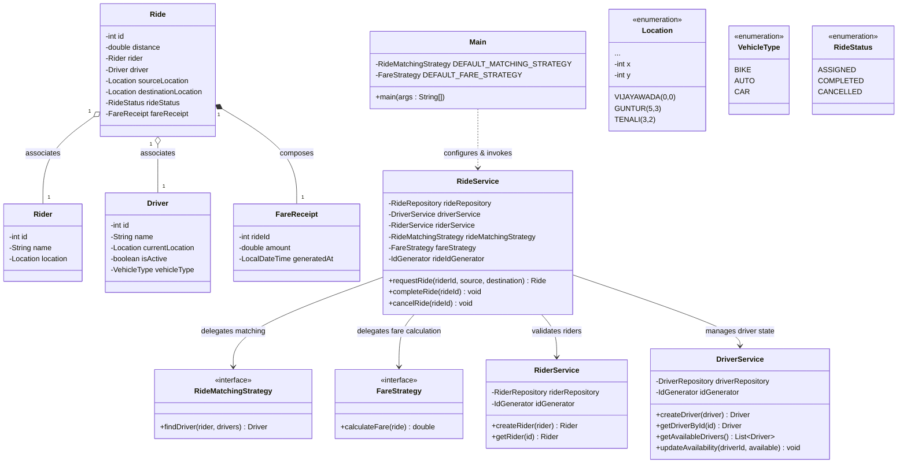

# Class Model Reference

This document explains the classes in the RideWise project, their responsibilities, and their relationships.

---

## 🗂️ Class Diagram (Mermaid)

---

## 📝 Class Responsibilities

### 1. Model Layer (`com.airtribe.ridewise.model`)

| Class | Type | Responsibility |
|---|---|---|
| **Rider** | Class | Represents the rider domain model containing rider `id`, `name`, and current `Location`. |
| **Driver** | Class | Represents the driver domain model containing driver `id`, `name`, `currentLocation`, `isActive` availability flag, and `VehicleType`. |
| **Ride** | Class | Orchestrates the details of a single booking, including the distance, driver, rider, source, destination, status, and composition of the `FareReceipt`. |
| **FareReceipt** | Class | Read-only receipt detailing the cost of the ride and generation timestamp. |
| **Location** | Enum | Contains pre-populated, immutable coordinates of various Andhra Pradesh cities. |
| **VehicleType** | Enum | Categorizes vehicle modes: `BIKE`, `AUTO`, `CAR`. |
| **RideStatus** | Enum | Defines possible lifecycle states of a ride: `ASSIGNED`, `COMPLETED`, `CANCELLED`. |

### 2. Strategy Layer (`com.airtribe.ridewise.strategy`)

- **RideMatchingStrategy (Interface)**: Defines contract for selecting a driver from a list of available candidates.
  - **NearestDriverStrategy**: Matches driver based on minimum Euclidean distance to rider.
  - **LeastActiveDriverStrategy**: Matches driver based on minimal prior rides count in the system.
- **FareStrategy (Interface)**: Defines contract for calculating ride fares.
  - **DefaultFareStrategy**: Calculates fare based on base rate and per-kilometer rate of vehicle type.
  - **PeakHourFareStrategy**: Decorator wrapper applying a 1.5x multiplier to the base fare during peak hours.

### 3. Service Layer (`com.airtribe.ridewise.service`)

- **RiderService**: Validates and saves riders. Auto-generates IDs using Rider ID Generator.
- **DriverService**: Manages registration, availability toggling, and queries for available drivers.
- **RideService**: Coordinates the booking flow, driver matching, pricing computation, saving active bookings, completing them, or cancelling them.

### 4. Repository Layer (`com.airtribe.ridewise.repository`)

- **RiderRepository / DriverRepository / RideRepository**: Abstractions defining save, query, and lookup operations.
- **RiderRepositoryImpl / DriverRepositoryImpl / RideRepositoryImpl**: Concrete in-memory stores using standard `HashMap` structures.

### 5. Utility Layer (`com.airtribe.ridewise.util`)

- **IdGenerator (Interface)**: Code abstraction defining thread-safe identifier generation.
  - **RiderIdGenerator / DriverIdGenerator / RideIdGenerator**: Generates incrementing IDs starting from 1 for respective entities.
- **DistanceCalculator**: Handles mathematical calculation of distance between locations using Cartesian coordinates.
